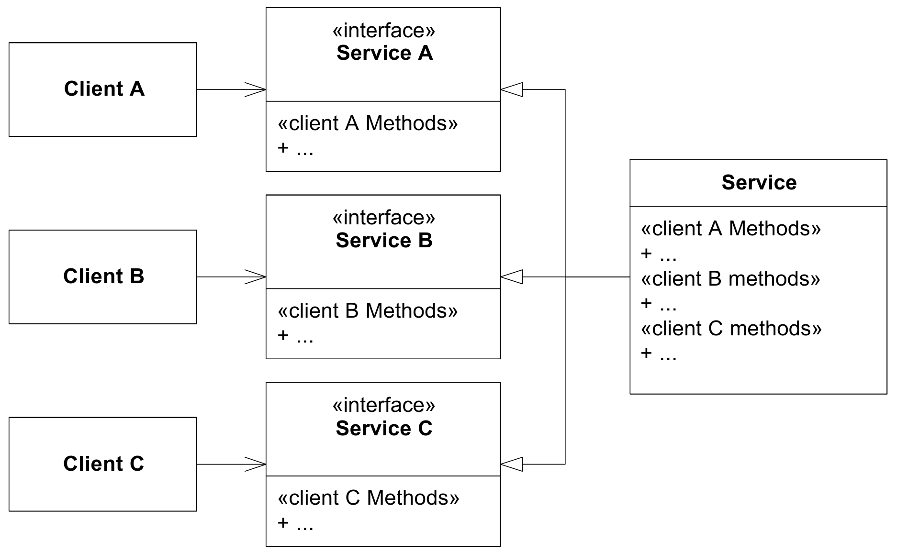

# Objectgeoriënteerd Programmeren

<!-- .element: style="font-size: 2.2em;" -->

Q-highschool / Bijeenkomst 5

---

## Vandaag

- Inchecken
- SOLID design
- Animaties
- Merge conflicts oplossen?
- Uitchecken

***

<!-- .slide: style="text-align: left" -->

## Inchecken

Wat heb je nog gedaan?

Wat wil je vandaag leren?

***

## SOLID

principes voor objectgeoriënteerd ontwerp

Notes:
Van "Uncle Bob" Robert C. Martin, bekend van het Agile manifesto en zijn boek "Clean Code".

---

<!-- .slide: style="text-align: left" -->

**S**ingle responsibility principle\
**O**pen-closed principle\
**L**iskov substitution principle\
**I**nterface segregation principle\
**D**ependency inversion principle

Notes:

Bronnen:
- [ArticleS.UncleBob.PrinciplesOfOod](http://butunclebob.com/ArticleS.UncleBob.PrinciplesOfOod)
- [SOLID - Wikipedia](https://en.wikipedia.org/wiki/SOLID)
- [Principles_and_Patterns.pdf](https://objectmentor.com/resources/articles/Principles_and_Patterns.pdf)

---

### Single responsibility

> Gather together the things that change for the same reasons.\
> Separate those things that change for different reasons.

Ook wel: *separation of concerns*

Notes:
De redenen voor verandering komt altijd vanuit mensen, dus het gaat erom dat een mens die een bepaald *concern* (zorg) heeft vanuit hun rol.

De *physics engine* is los van alle objecten die door *physics* beïnvloed worden, want als je de natuurkundige regels van je wereld wilt aanpassen, dan moet er één plek zijn waar je dat doet.

Bronnen:
- [Clean Coder Blog](https://blog.cleancoder.com/uncle-bob/2014/05/08/SingleReponsibilityPrinciple.html)

---

### Open-closed

Open voor uitbreiding,\
gesloten voor aanpassing.

Notes:
We bouwen voort op een `Sprite` en voegen daar gedrag aan toe, zonder dat we de code van `Sprite` hoeven aan te passen. Als we een nieuw soort `Sprite` willen toevoegen, dan hoeven we daarvoor niet de code van `Sprite` te veranderen: die is gesloten voor aanpassing.

---

### Liskov substitution

Een subclass moet altijd doorgeven kunnen worden op een plek waar de `super()`-class wordt verwacht.

Notes:
Dus onze `MainPlayer` moeten we aan iedere functie die een `Sprite` verwacht kunnen meegeven, zonder dat dingen stukgaan. Een subclass mag dus geen dingen doen die niet in het "contract" van de superclass staan: je mag dus niet een `Sprite` maken waarbij je de `update()` methode altijd een foutmelding laat geven.

Barbara Liskov heeft o.a. hiervoor haar Turing-award gekregen, dat is de Nobelprijs van de informatica.

---

### Interface segregation

Een "client" hoeft niets te weten over methodes die die niet nodig heeft.

 

<!-- .element: class="r-stretch" -->

Notes:
Python heeft geen interfaces zoals die in andere talen wel bestaan, maar lost dat op door multiple-inheritance toe te staan, zodat je meerdere base classes kunt hebben die een vergelijkbare rol vervullen.

Bronnen:
- [Principles_and_Patterns.pdf](https://objectmentor.com/resources/articles/Principles_and_Patterns.pdf)

---

### Dependency inversion

> Depend upon abstractions.\
> Do not depend upon concretions.

Notes:
Vertaling: schrijf een functie die een `Sprite` verwacht, als je niet de functionaliteit van de `MainPlayer` nodig hebt. Zorg dat er een abstractere `Enemy` class is als je meerdere soorten enemies maakt, en dat algemene functionaliteit op die `Enemy` class werkt in plaats van op concrete enemies.

---

<!-- .slide: style="text-align: left" -->

**S**ingle responsibility principle\
**O**pen-closed principle\
**L**iskov substitution principle\
**I**nterface segregation principle\
**D**ependency inversion principle

Notes:
Dit zijn richtlijnen, altijd afwegingen te maken.

***

## Animaties

Notes:
Wat hebben we daarvoor nodig?

***

## Is er al een merge conflict?

***

<!-- .slide: style="text-align: right" -->

## Uitchecken

Wat heb je vandaag geleerd?

Wat wil je voor de volgende bijeenkomst zelf doen?

Wat wil je in de volgende bijeenkomst leren?
