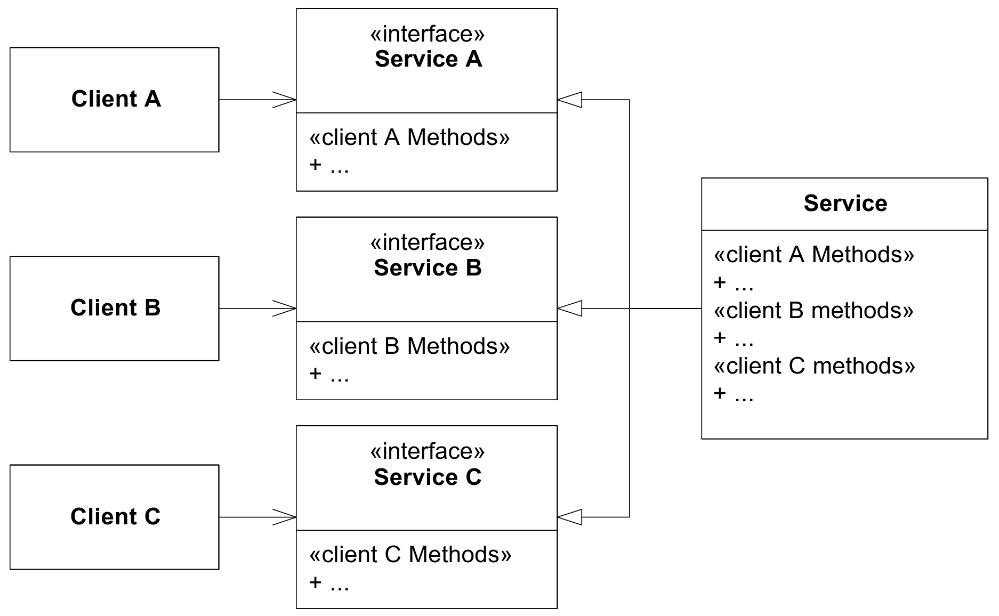

# SOLID principes voor objectgeoriënteerd ontwerp

Ons doel bij het schrijven van objectgeoriënteerde software is dat de code door andere mensen gelezen, begrepen en vooral ook aangepast kan worden. SOLID is een verzameling van vijf principes die je erbij helpen om je code op die manier op te bouwen. De principes gaan al een tijdje mee en werden door diverse mensen uitgevonden. De bundeling onder de naam SOLID is bedacht door "Uncle Bob" Robert C. Martin, bekend van het Agile manifesto en zijn boek "Clean Code".

De vijf principes zijn:

- **S**ingle responsibility principle
- **O**pen-closed principle
- **L**iskov substitution principle
- **I**nterface segregation principle
- **D**ependency inversion principle

Hieronder gaan we iets dieper in op ieder van de vijf principes.

## Single responsibility principle

> Gather together the things that change for the same reasons.
> Separate those things that change for different reasons.

Dus: verzamel de dingen die om dezelfde redenen veranderen op dezelfde plek en houdt dingen die om verschillende redenen veranderen uit elkaar. De reden dat je code verandert, is altijd dat iemand wil dat je programma anders werkt. Je moet dus vooraf nadenken over wat mogelijk op een later moment wel en niet zou kunnen veranderen om een goede verdeling te maken.

In het geval van onze game: de *physics engine* is los van alle objecten die door *physics* beïnvloed worden, want als je de natuurkundige regels van je wereld wilt aanpassen, dan moet er één plek zijn waar je dat doet. En als je wilt veranderen hoe een speler eruit ziet, dan doe je dat op een andere plek dan wanneer je wilt aanpassen hoe de speler naar beneden valt.

Dit principe wordt ook wel *separation of concerns* genoemd: je wilt de verschillende "zorgen" die met jouw programma opgelost worden uit elkaar houden.

## Open-closed principle

Classes moeten open zijn voor uitbreiding, gesloten voor aanpassing. In de game bouwen we dus voort op een `Sprite` en voegen daar gedrag aan toe, zonder dat we de code van `Sprite` hoeven aan te passen: in plaats daarvan maken een subclass. We kunnen het dus uitbreiden (daar is de `Sprite` open voor), zonder die class zelf te veranderen (dus gesloten voor wijzigingen).

## Liskov substitution

Een subclass moet altijd doorgeven kunnen worden op een plek waar de `super()`-class wordt verwacht. Dus onze `MainPlayer` moeten we aan iedere functie die een `Sprite` verwacht kunnen meegeven, zonder dat dingen stukgaan. Een subclass mag dus geen dingen doen die niet in het "contract" van de superclass staan: je mag dus niet een `Sprite` maken waarbij je de `update()` methode altijd een foutmelding laat geven.

Leuk feitje: Barbara Liskov heeft onder andere voor dit idee een Turing-award gekregen, zeg maar de Nobelprijs van de informatica.

## Interface segregation

Een "client" hoeft niets te weten over methodes die die niet nodig heeft. Dus als een deel van jouw programma alleen een deel van de methodes van een class nodig heeft, let er dan op dat je niet per ongeluk ook andere dingen gebruikt en zo de onderdelen van je programma te strak aan elkaar knoopt, want dat maakt het moeilijk om dingen te veranderen. Als alle onderdelen van je programma van elkaar afhangen, is de kans groot dat een kleine wijziging er toch toe leidt dat er iets stuk gaat.

 

Python heeft geen interfaces zoals die in andere talen wel bestaan. In plaats daarvan is multiple-inheritance toegestaan, zodat je meerdere base classes kunt hebben die een vergelijkbare rol vervullen. In de praktijk doe je dit in Python echter vooral door voorzichtig te zijn met het aanroepen van methodes die je niet per se nodig hebt.

## Dependency inversion

> Depend upon abstractions. Do not depend upon concretions.

Vertaling naar onze game: schrijf een functie die een `Sprite` verwacht, als je niet de functionaliteit van de `MainPlayer` nodig hebt. Zorg dat er een abstractere `Enemy` class is als je meerdere soorten enemies maakt, en dat algemene functionaliteit op die `Enemy` class werkt in plaats van op concrete enemies. Zo kun je de code die je schrijft later makkelijker hergebruiken voor bijvoorbeeld andere `Sprite`s of `Enemy`s.

## Tot slot

Dit zijn richtlijnen, dus in de praktijk moet je altijd een afweging maken of het inderdaad leesbaardere en makkelijker te onderhouden code oplevert. Het kan ook gebeuren dat meerdere principes elkaar tegenspreken, waarbij je dus zelf een keuze moet maken. Uiteindelijk komt een goed ontwerp daar altijd op neer: goed overwogen keuzes maken. Deze principes zijn een manier om je keuzes te overdenken, maar het zijn geen harde regels.

Bronnen om verder te lezen, mocht je hier dieper in willen duiken:

- [ArticleS.UncleBob.PrinciplesOfOod](http://butunclebob.com/ArticleS.UncleBob.PrinciplesOfOod)
- [Clean Coder Blog: The Single Responsibility Principle](https://blog.cleancoder.com/uncle-bob/2014/05/08/SingleReponsibilityPrinciple.html)
- [SOLID - Wikipedia](https://en.wikipedia.org/wiki/SOLID)
- [Principles_and_Patterns.pdf](https://objectmentor.com/resources/articles/Principles_and_Patterns.pdf)
