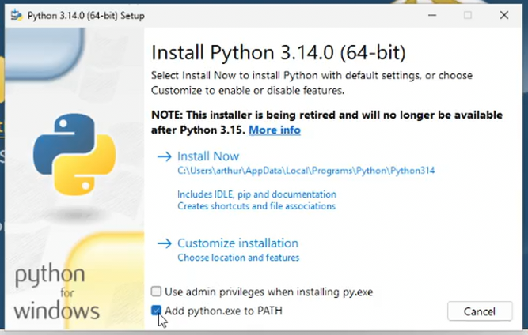
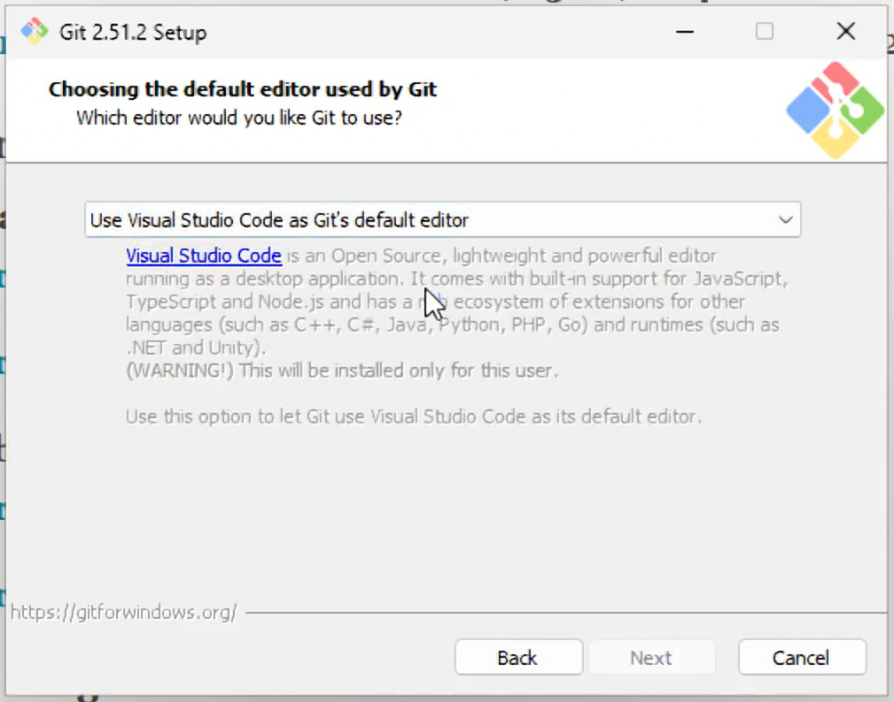

# Tools installeren

Bij deze module heb je een aantal tools nodig om aan de game te kunnen werken:

- [Visual Studio Code](https://code.visualstudio.com/)
- [Python](https://www.python.org/downloads/)
- [Git](https://git-scm.com/install/)
- [Tiled](https://www.mapeditor.org/)
- Voor Windows: [Visual C++ (onderdeel van Visual Studio 2026)](https://visualstudio.microsoft.com/downloads/)

Een aantal heb je vast al eerder gezien, maar anderen zijn misschien nieuw. Hieronder staan voor iedere tool een paar hints voor het installeren.

## Visual Studio Code

Download [Visual Studio Code](https://code.visualstudio.com/) en voer de installer uit. De meeste standaard-opties zijn prima, maar het is aan te raden om ook de Add ‘Open with Code’ action to Windows Explorer … opties aan te vinken.


Nadat je VS Code hebt geïnstalleerd, moet je ook de extensie voor Python nog installeren:


## Python

Voor Arcade, de gamelibrary die we gebruiken, wordt aangeraden om *niet* de Python versie uit de Windows Store te gebruiken[^store], maar die te installeren vanaf de website. Ga naar [Download Python](https://www.python.org/downloads/) en gebruik de link bij "Or get the standalone installer for Python ..." om de directe installer te downloaden.

[^store]: Als je die al op je computer hebt staan, kun je het gewoon proberen. Als je tegen rare problemen aanloopt, dan is het mogelijk dat een nieuwe Python-installatie via de website dit oplost.

Vink de optie "Add python.exe to PATH" aan:



En kies de optie "Install Now".

## Git

Download de Git installer via [de website](https://git-scm.com/install/). De meeste standaardopties zijn prima, maar kies Visual Studio Code als je "default editor" als daarom wordt gevraagd:



Nadat je Git hebt geïnstalleerd, moet je nog jouw naam en e-mailadres instellen. Die worden gebruikt om aan te geven wie welke wijzigingen in de code hebben gemaakt, dus kies een herkenbare naam! Open een Terminal venster en geef de volgende commando's:

```shell
git config --global user.name "Jouw Naam"
git config --global user.email "jouw.email@example.com"
```

## Tiled

Klik op de "Download on itch.io" knop op de [Tiled website](https://www.mapeditor.org/) en kies daar voor "Download Now". Als je niet wilt doneren, gebruik dan de "No thanks, just take me to the downloads" link en download de juiste versie voor jouw besturingssysteem. Je mag de optie "Create a desktop shortcut" uitzetten, als je daar behoefte aan hebt, maar verder zijn de standaardoptie prima.

## Voor Windows: Visual Studio 2026

Voordat je Arcade kunt installeren op Windows, heb je nog een C++ compiler nodig voor een aantal native libraries die door Arcade gebruikt worden. Download de [Visual Studio 2026 Community edition](https://visualstudio.microsoft.com/downloads/). Kies in de installer de **Python development** workload en vink in de rechterbalk ook de optie **Python native development tools** aan. De standaardopties zijn verder prima.
