# Tools installeren

Bij deze module heb je een aantal tools nodig om aan de game te kunnen werken:

- [Python](https://www.python.org/downloads/)
- [Visual Studio Code](https://code.visualstudio.com/)
- [Git](https://git-scm.com/install/)
- [Tiled](https://www.mapeditor.org/)
- Voor Windows: [Visual C++ (onderdeel van Visual Studio 2026)](https://visualstudio.microsoft.com/downloads/)

Een aantal heb je vast al eerder gezien, maar anderen zijn misschien nieuw. Hieronder staan voor iedere tool een paar hints voor het installeren.

## Python

Voor Arcade, de gamelibrary die we gebruiken, wordt aangeraden om *niet* de Python versie uit de Windows Store te gebruiken[^store], maar die te installeren vanaf de website. Ga naar [Download Python](https://www.python.org/downloads/) en klik op de grote *Download Python install manager* knop en start de installer die je hebt gedownload. Klik op de *Installeer Python* knop en zorg dat de optie om de Python Install Manager te starten na het installeren is aangevinkt.

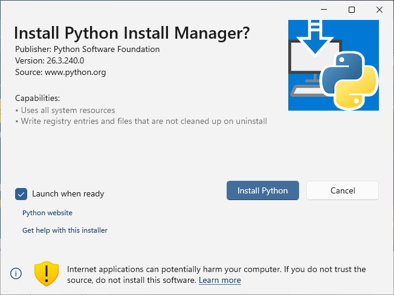

[^store]: Als je die al op je computer hebt staan, kun je het gewoon proberen. Als je tegen rare problemen aanloopt, dan is het mogelijk dat een nieuwe Python-installatie via de website dit oplost.

Antwoord `y` op de vraag om de instelling voor de lengte van bestandspaden aan te passen, en druk op Enter:

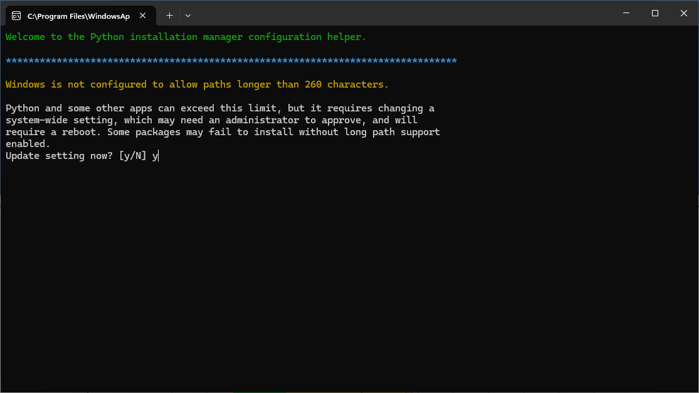

Geef vervolgens toestemming om wijzigingen aan je apparaat aan te brengen in de popup die verschijnt. Antwoord `y` op de vraag om een map aan je PATH toe te voegen:

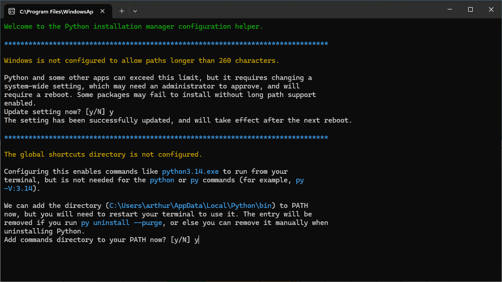

Wederom `y` om Python daadwerkelijk te installeren:

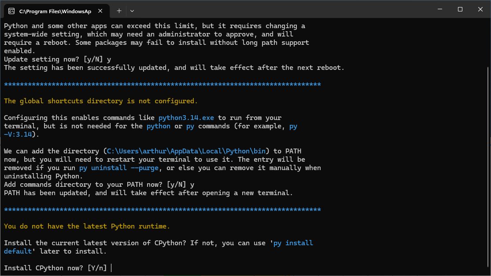

Op de laatste vraag of je de documentatie wilt bekijken, kun je `n` antwoorden:

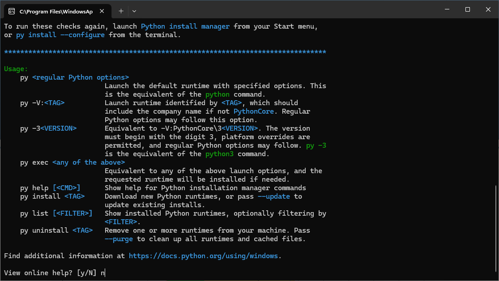

## Visual Studio Code

Download [Visual Studio Code](https://code.visualstudio.com/) en voer de installer uit. De meeste standaard-opties zijn prima, maar het is aan te raden om ook de *Add ‘Open with Code’ action to Windows Explorer…* opties aan te vinken.

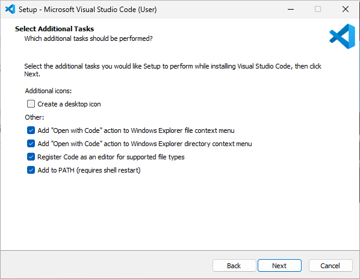

Als VS Code opent, dan krijg je de vraag om in te loggen. Dat kun je doen, maar is niet nodig, dus voel je vrij om die popup weg te klikken. Nadat je VS Code hebt geïnstalleerd, moet je ook de extensie voor Python nog installeren:

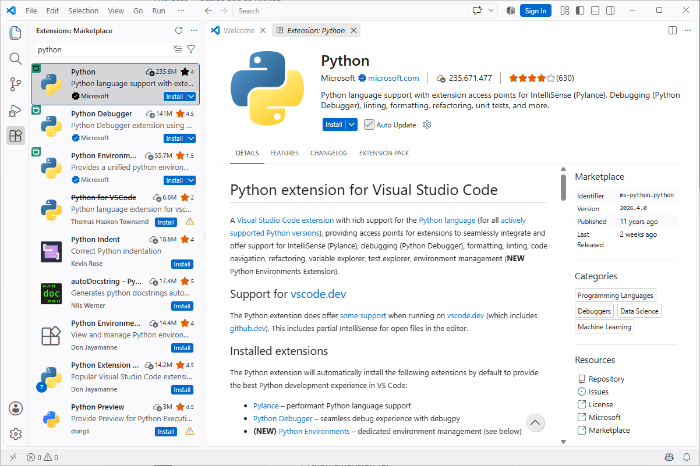

Installeer ook de EditorConfig extensie, die ervoor zorgt dat een project een aantal standaard codestijl regels kan instellen.

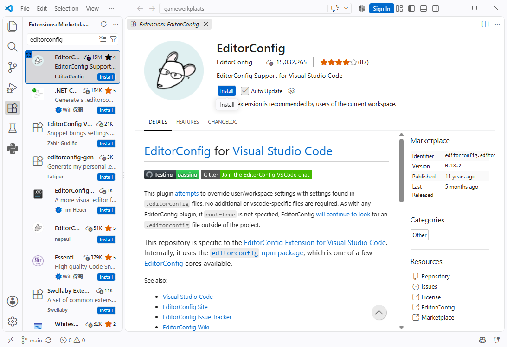

Als je een variant van Code hebt geïnstalleerd die niet van Microsoft komt (bijvoorbeeld [VSCodium](https://vscodium.com/) of [Theia](https://theia-ide.org/)), dan is de Pylance[^pylance] extensie niet beschikbaar. Als alternatief kun je kiezen voor [BasedPyright](https://open-vsx.org/extension/detachhead/basedpyright), [Pyrefly](https://open-vsx.org/extension/meta/pyrefly) of [ty](https://open-vsx.org/extension/astral-sh/ty).

[^pylance]: De Python extensie in VS Code is een verzameling van drie extensies, waaronder Pylance. Pylance is de extensie die ervoor zorgt dat waarschuwingen en foutmeldingen krijgt bij foute Python code, suggesties voor welke functies bestaan en snel de documentatie daarvan kunt lezen. Pylance is niet open-source, maar bouwt voort op Pyright, wel een open-source project van Microsoft. BasedPyright is een fork daarvan met functies van Pylance eraan toegevoegd. Ja, dit is een puinzooi. Bedankt, Microsoft.

## Git

Download de Git installer via [de website](https://git-scm.com/install/). De meeste standaardopties zijn prima, maar kies Visual Studio Code als je "default editor" als daarom wordt gevraagd:

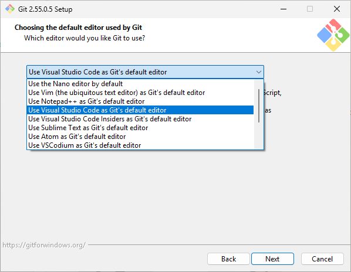

Als het gaat over de naam van de "intial branch", dan is de tweede optie tegenwoordig de meer gebruikelijke standaard:

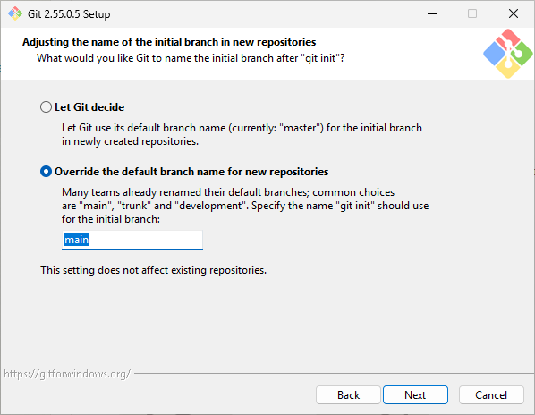

Aan het einde kun je het vinkje bij *View Release Notes* uitzetten:

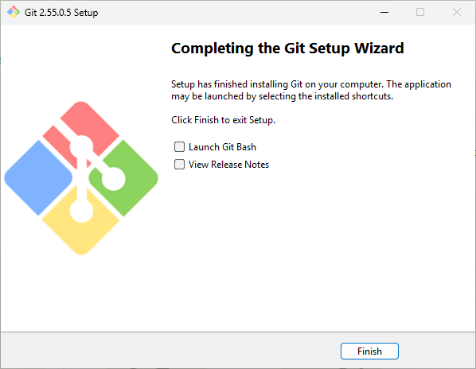

Nadat je Git hebt geïnstalleerd, moet je nog jouw naam en e-mailadres instellen. Die worden gebruikt om aan te geven wie welke wijzigingen in de code hebben gemaakt, dus kies een herkenbare naam! Open een Terminal venster (klik met de rechtermuisknop op het startmenu en kies *Terminal*) en geef de volgende commando's:

```shell
git config --global user.name "Jouw Naam"
git config --global user.email "jouw.email@example.com"
```

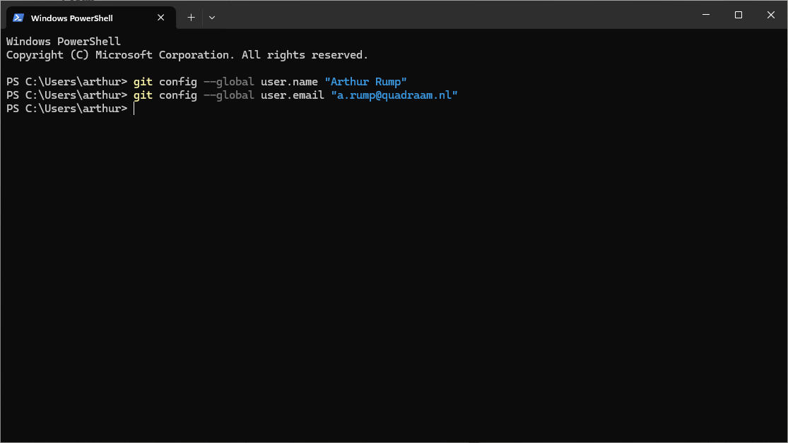

## Tiled

Klik op de *Download on itch.io* knop op de [Tiled website](https://www.mapeditor.org/) en kies daar voor *Download Now*. Als je niet wilt doneren, gebruik dan de *No thanks, just take me to the downloads* link en download de juiste versie voor jouw besturingssysteem. Je mag de optie *Create a desktop shortcut* uitzetten, als je daar behoefte aan hebt, maar verder zijn de standaardoptie prima.

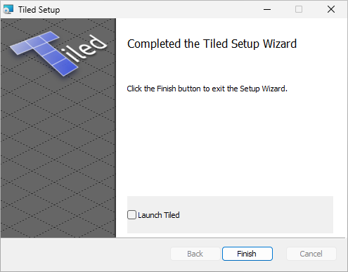

## Voor Windows: Visual Studio Community

Voordat je Arcade kunt installeren op Windows, heb je nog een C++ compiler nodig voor een aantal native libraries die door Arcade gebruikt worden. Download [Visual Studio Community](https://visualstudio.microsoft.com/downloads/) en start de installer. Kies de **Python development** workload en vink in de rechterbalk ook de optie **Python native development tools** aan. De **GitHub Copilot** optie kun je daar uitvinken om ruimte te besparen. De standaardopties zijn verder prima.

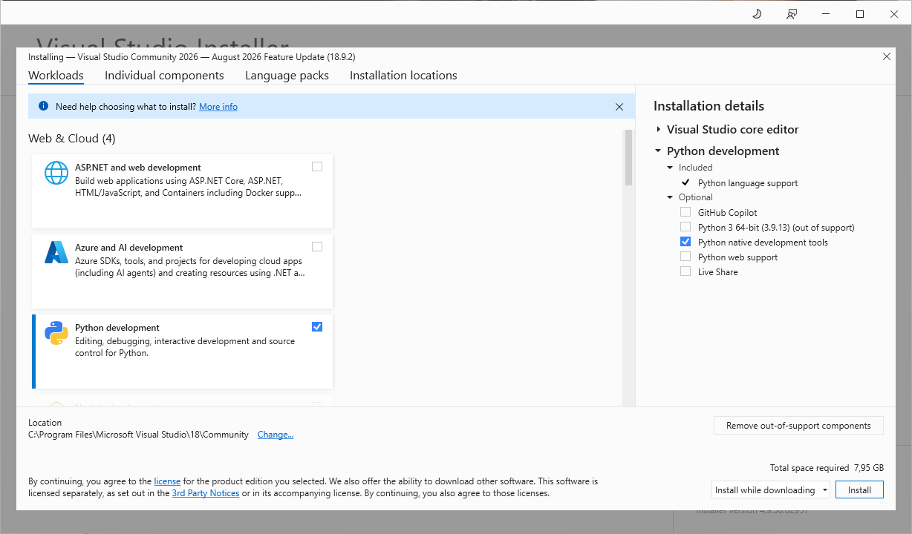

Als de installer klaar is, kun je het venster sluiten.
