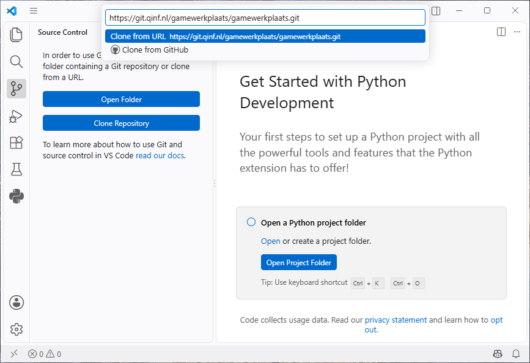
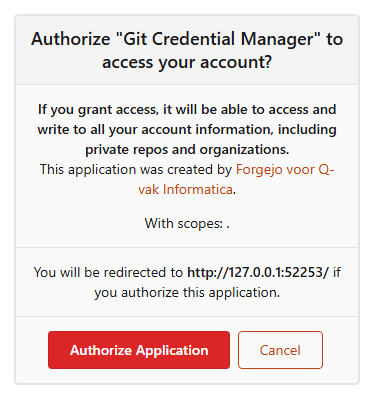
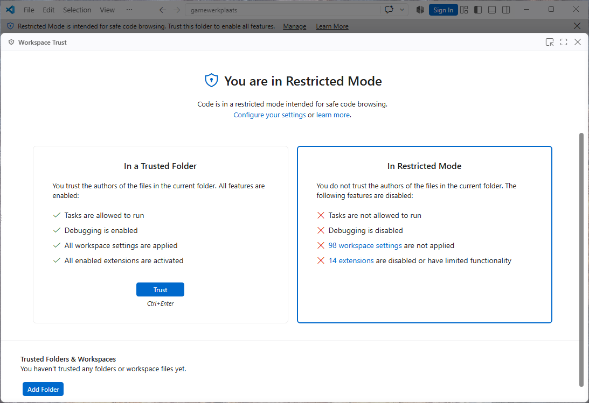
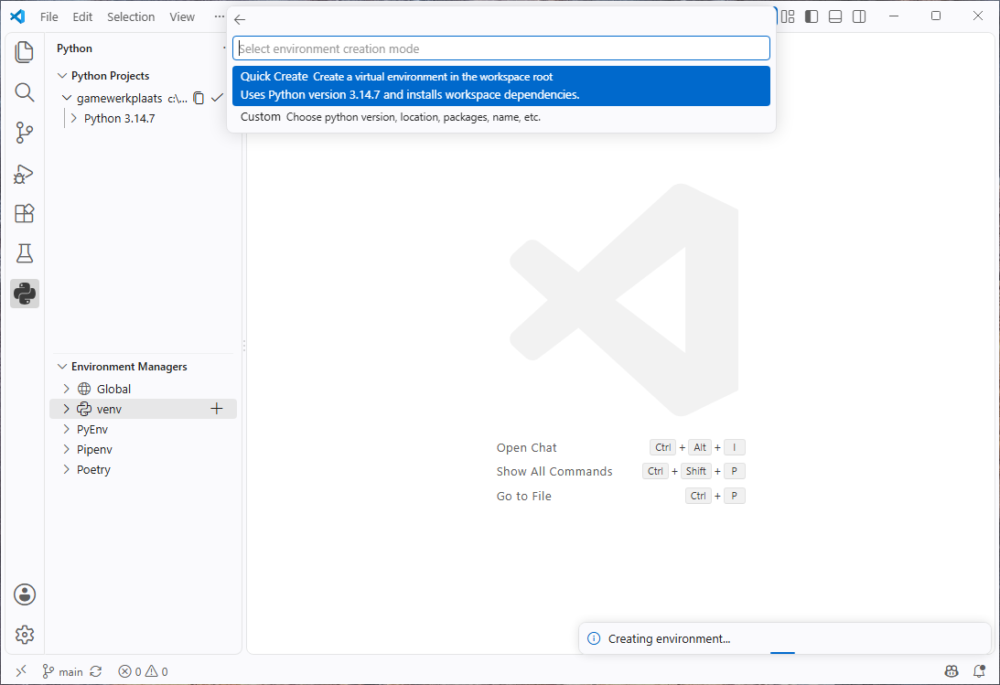

# Aan de slag in de Werkplaats

Je hebt via de mail een uitnodiging gekregen voor de organisatie van De Gamewerkplaats op [git.qinf.nl](https://git.qinf.nl), de Git server voor Q-vak Informatica. Klik op de link en maak een account aan om de uitnodiging te accepteren. Als je dat hebt gedaan, krijg je daarmee toegang tot [de repository]({{ repo }}) die we dit blok gaan gebruiken. In die repository werken we samen aan de code van de game. Om er zelf mee aan de slag te gaan, maak je een kopie op je eigen computer. Dat doen we in VS Code.

## git clone

Klik op *Clone Repository* in de *Source Control* sectie van de linker zijbalk (die met drie cirkels). Plak de link naar de repository in het invoerveld en druk op enter. Let op dat je de juiste link gebruikt, die je vindt op de webpagina van [de repository]({{ repo }}), rechtsboven de bestandenlijst.

Kies vervolgens een map waar je de repository wilt opslaan (bij voorkeur niet in OneDrive, dat levert soms problemen op i.c.m. Git). Je browservenster opent vervolgens om in te loggen op git.qinf.nl. Geef de Git Credential Manager toegang met de knop *Authorize Application* en sluit je browser. 

Gefeliciteerd, je hebt nu een lokale kopie van de game op jouw computer!

In VS Code wordt je nu gevraagd of je de repository wilt openen. Klik op *Open*. Standaard openen nieuwe mappen in de zogenaamde *Restricted Mode*, waarin veel dingen niet werken. Klik op de knop *Restricted Mode* linksonderin, klik op de knop *Trust* en sluit de popup.

Open de *Python* zijbalk en klik in de sectie *Environment Managers* op de + naast *venv*. (Mocht je die zijbalk niet zien, gebruik dan <kbd>Ctrl+Shift+P</kbd> en voer het commando *Python: Create Environment...* uit.) Kies vervolgens de *Quick Create* optie. Hiermee wordt een speciale Python omgeving aangemaakt voor dit project en daarin wordt arcade, de gamelibrary die we gebruiken, geïnstalleerd.

## De game uitvoeren

Gebruik de sneltoets F5 om het spel te starten. Je kunt ook naar de *Run and Debug* zijbalk gaan (die met het icoon van een play-knop met een kever erbij) en vervolgens de groene play-knop bovenin het scherm gebruiken.

## Wijzigingen maken

Voordat je dingen gaat aanpassen, maak je eerst een eigen "branch": daarin kun je dan wijzigingen maken en naar GitHub sturen, zonder dat je met je klasgenoten in conflict raakt. Gebruik <kbd>Ctrl+Shift+P</kbd>, kies het commando "Git: Checkout to...", kies de optie "+ Create new branch..." en voer je eigen naam in als naam van de branch. Later kun je dit gebruiken om per nieuwe feature of set aan wijzigingen een branch aan te maken, maar voor nu kun je gewoon onder je eigen naam beginnen.

Een goed begin is met een aantal wijzigingen aan de *map*, die beschrijft hoe onze wereld eruit ziet. Open Tiled en open het bestand *resources/maps/main.tmx*. Sla het bestand op en voer de game opnieuw uit in Visual Studio Code om je gewijzigde game te spelen.
